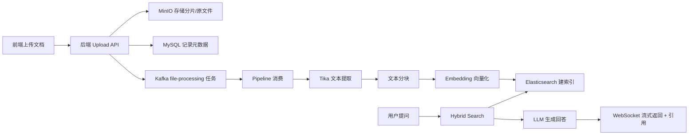

# WeaveKnow

WeaveKnow 是一个面向企业知识库场景的 RAG（Retrieval Augmented Generation）系统，提供**文档上传解析、向量检索、引用问答、组织级权限隔离**等能力。  
项目采用 **Go + Vue 3** 全栈实现，支持本地开发与 Docker 一键部署。

## 功能特性

- 📄 **文档知识化**：支持 PDF / Office / TXT / Markdown 文档上传、解析、分块、向量化
- 🚀 **大文件上传**：分片上传、断点续传、MD5 秒传
- 🔍 **混合检索**：向量语义检索 + 关键词检索（BM25）+ 可选重排
- 💬 **流式问答**：WebSocket 实时返回回答与引用来源
- 🏢 **多租户权限**：公开 / 组织 / 私有三级可见性控制
- 🧠 **会话记忆增强**：结构化记忆写入、检索、衰减与清理
- 🤖 **Agent 模式**：支持多轮工具调用式问答（可开关）

## 技术栈

- **后端**：Go 1.23+、Gin、GORM、WebSocket
- **前端**：Vue 3、TypeScript、Vite、Naive UI、Pinia、UnoCSS
- **基础设施**：MySQL 8、Redis 7、Elasticsearch 8、Kafka、MinIO、Apache Tika
- **模型服务**：DashScope Embedding、DeepSeek / Ollama（可替换）

## 系统架构（简图）



## 目录结构

```text
.
├── cmd/server/              # 服务入口
├── configs/                 # 本地配置（config.yaml）
├── deployments/             # Docker 部署文件
├── docs/                    # DDL 等文档
├── frontend/                # Vue 前端
├── internal/
│   ├── handler/             # HTTP/WebSocket 接口层
│   ├── middleware/          # 认证与鉴权中间件
│   ├── pipeline/            # Kafka 文档处理流水线
│   ├── repository/          # 数据访问层
│   └── service/             # 业务逻辑层
└── pkg/                     # 基础能力封装（ES/Kafka/LLM/MinIO 等）
```

## 快速开始

### 1) 环境要求

- Go >= 1.23
- Node.js >= 18.20
- pnpm >= 8.7
- Docker + Docker Compose（推荐）

---

### 2) 方式 A：Docker 一键启动（推荐）

1. 编辑 `deployments/config.docker.yaml`，至少补齐：
   - `embedding.api_key`
   - `llm.api_key`

2. 在项目根目录启动：

```bash
docker compose -f deployments/docker-compose.yaml up -d --build
```

3. 查看状态：

```bash
docker compose -f deployments/docker-compose.yaml ps
docker compose -f deployments/docker-compose.yaml logs -f backend
```

4. 停止：

```bash
docker compose -f deployments/docker-compose.yaml down
```

> 后端默认地址：`http://localhost:8081`

---

### 3) 方式 B：本地开发（后端 + 前端）

#### 3.1 启动依赖服务（MySQL/Redis/Kafka/ES/MinIO/Tika）

```bash
docker compose -f deployments/docker-compose.yaml up -d mysql redis minio minio-init tika zookeeper kafka kafka-init es
```

#### 3.2 配置后端

编辑 `configs/config.yaml`，重点确认：

- `database.mysql.dsn`（默认 `127.0.0.1:3307`）
- `database.redis.addr`（默认 `127.0.0.1:6380`）
- `embedding.api_key`
- `llm.api_key`

#### 3.3 启动后端

```bash
go mod download
go run cmd/server/main.go
```

#### 3.4 启动前端

```bash
cd frontend
pnpm install
pnpm run dev
```

前端启动后，按 Vite 输出地址访问（通常是 `http://localhost:5173`）。

## 常用命令

### 后端

```bash
# 编译
go build -o bin/server cmd/server/main.go

# 运行
go run cmd/server/main.go

# 格式化
go fmt ./...

# 测试（当前部分 service 用例仍在跟进）
go test ./...
```

### 前端

```bash
cd frontend
pnpm run dev
pnpm run dev:prod
pnpm run build
pnpm run build:test
pnpm run typecheck
pnpm run lint
```

## 关键接口

- REST API 基础路径：`/api/v1`
- WebSocket token：`GET /api/v1/chat/websocket-token`
- Chat 流式通道：`GET /chat/:token`

## 支持文档类型

- 扩展名：`.pdf .doc .docx .xls .xlsx .ppt .pptx .txt .md`

## 多租户权限模型

- **公开文档**：所有登录用户可见
- **组织文档**：同 `org_tag` 用户可见
- **私有文档**：仅上传者（或管理员）可见

## 开发提示

- 数据库初始化 SQL：`docs/ddl.sql`
- 默认日志目录：`./logs`
- 若根目录存在 `initfile/`，后端启动时会自动扫描并按上传流程导入文件

## License

[MIT](LICENSE)
